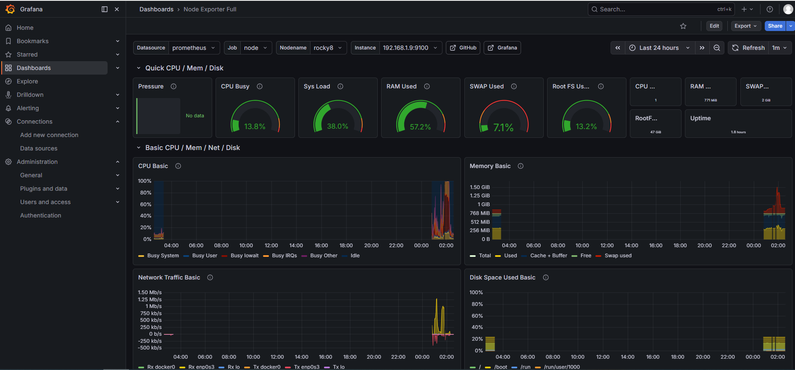
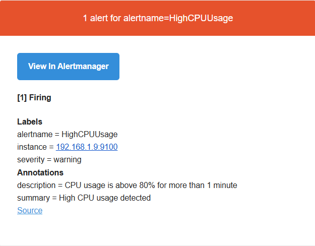
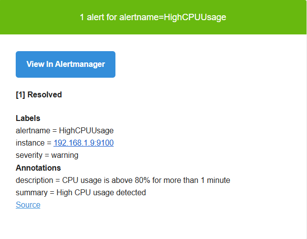
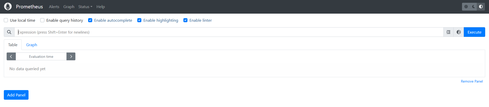
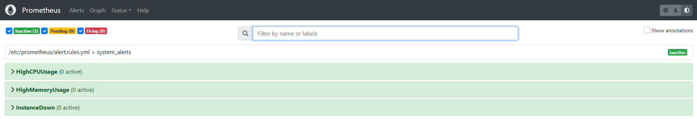
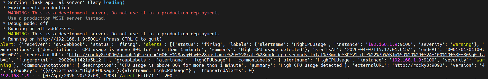

# 🤖 AI-Powered Self-Healing Monitoring System

<p>
  
  
  
  
  
  
</p>

---

## 🚀 Overview

This project demonstrates a **real-world DevOps monitoring system** enhanced with an **AI-powered auto-healing engine**.

Unlike traditional monitoring setups, this system not only detects issues but also:

* 🤖 Analyzes alerts
* ⚙️ Executes corrective actions
* 📧 Sends notifications

---

## 🧠 Architecture

```
                +------------------+
                |  Node Exporter   |
                +--------+---------+
                         |
                         v
                +------------------+
                |   Prometheus     |
                +----+--------+----+
                     |        |
                     |        v
                     |   +------------------+
                     |   |     Grafana      |
                     |   | (Visualization)  |
                     |   +------------------+
                     |
                     v
              +------------------+
              |  Alertmanager    |
              +----+--------+----+
                   |        |
                   |        v
                   |   🤖 AI Engine (Flask)
                   |        |
                   |        v
                   |   ⚙️ Auto Healing
                   |
                   v
               📧 Email Alert
```

---

## 🛠️ Tech Stack

| Component      | Purpose |
|----------------|--------|
| Prometheus     | Metrics collection & alerting |
| Alertmanager   | Alert routing (Email + Webhook) |
| Grafana        | Visualization dashboard |
| Node Exporter  | System metrics exporter |
| Flask (Python) | AI webhook & automation engine |

---

## ⚙️ Features

* 📊 Real-time system monitoring (CPU, Memory, Disk)
* 🚨 Alert generation based on thresholds
* 📧 Email notifications via SMTP (Gmail)
* 🤖 AI webhook integration
* ⚙️ Automated remediation (auto-healing)
* 📜 Logging of alerts and actions

---

## 🔁 Workflow

1. Node Exporter collects system metrics  
2. Prometheus scrapes and stores metrics  
3. Alert rules evaluate conditions  
4. Alertmanager:
   - Sends 📧 Email alerts  
   - Sends 🤖 Webhook to AI Engine  
5. Flask AI Engine:
   - Processes alert  
   - Executes auto-healing action  
   - Logs output

---

## 📂 Project Structure

```
ai-monitoring-system/
│
├── ai_server/
│ ├── ai_server.py
│ └── requirements.txt
│
├── prometheus/
│ ├── prometheus.yml
│ └── rules.yml
│
├── alertmanager/
│ ├── alertmanager.yml
│ └── service/
│ └── alertmanager.service
│
├── grafana/
│ ├── dashboards/
│ │ └── node_exporter_dashboard.json
│ └── provisioning/
│ └── datasource.yml
│
├── scripts/
│ ├── simulate_cpu.sh
│ └── test_alert.sh
│
├── logs/
│ ├── ai.log # runtime (ignored)
│ ├── sample_ai.log # sample AI logs
│ ├── sample_webhook.log # webhook logs
│ └── .gitkeep
│
├── docs/
│ ├── setup.md
│ └── sample_alert.json
│
├── .gitignore
└── README.md
```

---

## 📘 Documentation

For complete step-by-step setup and configuration:

* 📄 [Setup Guide](docs/setup.md)

---

## ⚡ Setup Guide (Quick Start)

---

## 📊 Grafana Dashboard

- Dashboard: **Node Exporter Full (ID: 1860)**
- Visualizes:
  - CPU usage
  - Memory usage
  - Disk utilization
  - Network metrics

⚠️ **Note:**
Dashboard is imported manually via Grafana UI due to datasource variable dependencies.

---

### 1️⃣ Start Node Exporter

```bash
./node_exporter &
```

### 2️⃣ Start Prometheus

```bash
./prometheus --config.file=prometheus.yml &
```

### 3️⃣ Start Alertmanager

```bash
./alertmanager --config.file=alertmanager.yml &
```

### 4️⃣ Start AI Engine

```bash
python3 ai_server.py
```

### 5️⃣ Setup Grafana

* Add Prometheus as datasource
* Import Node Exporter dashboard (ID: 1860)

---

## 🧪 Testing

Simulate high CPU usage:

```bash
yes > /dev/null &
```

---

## 📜 Sample Logs

### 🤖 AI Engine Logs

```
2026-04-07 21:21:01 | HighCPUUsage | 192.168.1.9:9100 | resolved
2026-04-07 21:23:31 | HighCPUUsage | 192.168.1.9:9100 | firing
```

### 🌐 Webhook Logs

```
192.168.1.9 - - [07/Apr/2026 21:21:01] "POST /alert HTTP/1.1" 200 -
192.168.1.9 - - [07/Apr/2026 21:23:31] "POST /alert HTTP/1.1" 200 -
192.168.1.2 - - [07/Apr/2026 21:25:20] "GET / HTTP/1.1" 404 -
```

---

## 📸 Screenshots

> Add:

* Grafana dashboard 📊

* Alert email 📧


* Prometheus Dashboard 📊


* Flask logs 🤖

---

## 🔐 Security Note

* Use **Gmail App Password**, not your real password
* Do not commit credentials to GitHub
* Use environment variables in production

---

## 🎯 Future Enhancements

* 🔁 Restart services instead of killing processes
* 📊 ML-based anomaly detection
* ☁️ Kubernetes integration
* 💬 Slack / Teams notifications
* 📈 Advanced dashboards

---

## 🧑‍💻 Author

**Sudhanshu Mishra**
DevOps Engineer | Linux | Automation | Monitoring

🔗 GitHub: https://github.com/devops-ssm2

---

## ⭐ Support

If you like this project:

* ⭐ Star the repo
* 🍴 Fork it
* 📢 Share it

---

## 🏁 Conclusion

This project demonstrates how modern monitoring can evolve into a **self-healing system using AI-driven automation**, reducing manual effort and improving reliability.

---